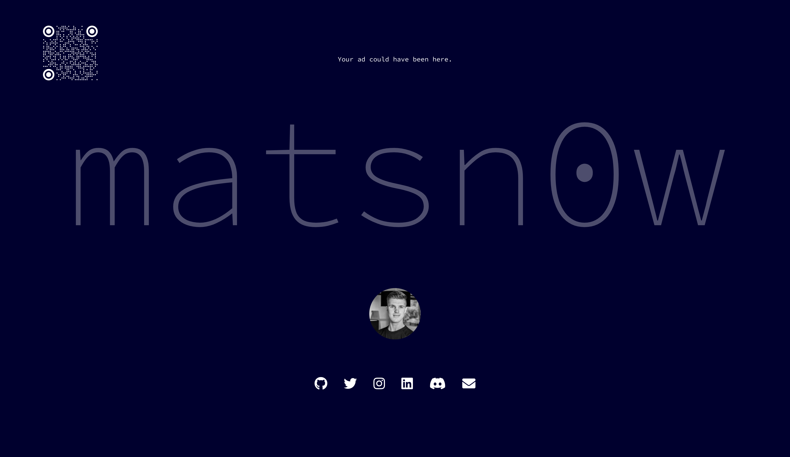

# matsn0w.dev

[](https://github.com/matsn0w/matsn0w.dev/actions/workflows/deployment.yml)

My personal website.

[Visit matsn0w.dev](https://matsn0w.dev)



## Development

Start a local server by running the following command:

```sh
npm run dev
```
